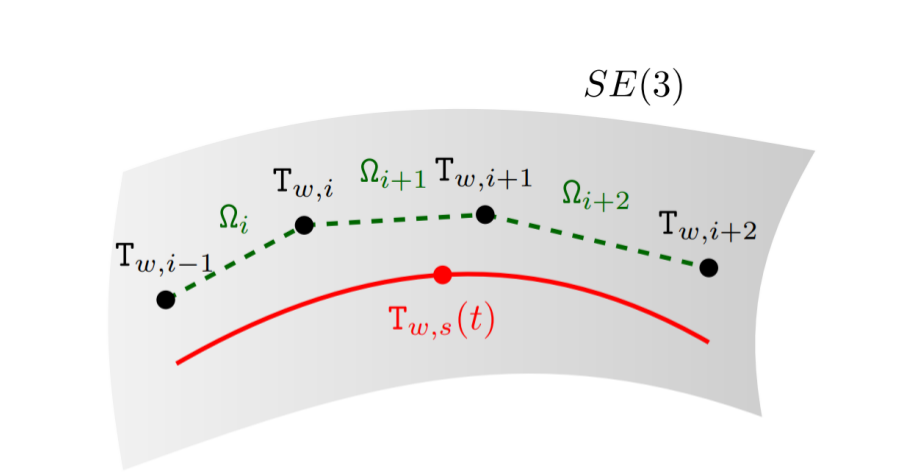

# SE3-pose-interpolation-using-bspline

## 1 Introduction

This is the implementation of spline fusion to fuse the pose in SE3.

This can be used for continuous-time estimate pose between Ti and Ti+1 with 4 poses, Ti-1,Ti, Ti+1, Ti+2.

