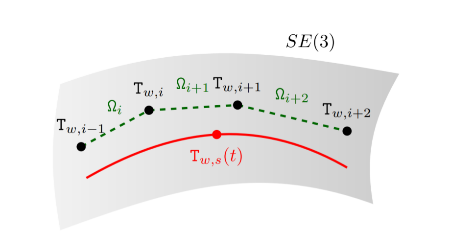

# SE(3) 位姿 B样条插值

**[English Version](README.md)** | **中文版**

基于B样条的SE(3)流形位姿插值C++实现，用于连续时间轨迹估计。



## 概述

本项目实现了在SE(3)（特殊欧几里得群）上的累积B样条插值，用于平滑的位姿估计。给定四个离散位姿（T_{i-1}, T_i, T_{i+1}, T_{i+2}），可以在T_i和T_{i+1}之间的任意时刻t进行连续时间位姿估计。

该方法特别适用于：
- 连续时间轨迹优化
- 视觉-惯性里程计
- 激光雷达里程计与建图
- 运动规划与控制
- 传感器融合应用

## 理论背景

### SE(3) 流形

SE(3)表示三维空间中的刚体变换群，由旋转和平移组成：

```
SE(3) = {T = [R t; 0 1] | R ∈ SO(3), t ∈ R³}
```

### SE(3) 上的 B样条插值

传统的B样条适用于欧几里得空间，但位姿位于SE(3)流形上。本实现采用B样条的累积形式结合李代数运算：

```
T(u) = exp(ξ₁) · exp(B₁(u) · log(T₁⁻¹T₂)) · exp(B₂(u) · log(T₂⁻¹T₃)) · exp(B₃(u) · log(T₃⁻¹T₄))
```

其中：
- `u ∈ [0,1]` 为插值参数
- `B₁(u) = (5 + 3u - 3u² + u³) / 6`
- `B₂(u) = (1 + 3u + 3u² - 2u³) / 6`
- `B₃(u) = u³ / 6`
- `log()` 为SE(3)对数映射
- `exp()` 为SE(3)指数映射

该公式保证：
- 流形上的平滑插值
- 正确处理旋转不连续性
- 轨迹的C²连续性

## 特性

- **流形感知插值**：使用李群运算正确处理SE(3)几何
- **累积B样条公式**：数值稳定的实现
- **连续时间估计**：可在任意时间戳查询位姿
- **可视化支持**：生成轨迹的点云可视化
- **高效计算**：使用Eigen和Sophus库优化

## 依赖项

项目需要以下库：

- **CMake** (>= 2.8)
- **Eigen3**：线性代数库
- **Sophus**：用于SE(3)运算的李群库
- **PCL**（点云库）：用于点云处理和可视化
- **OpenCV**：计算机视觉库
- **fmt**：现代格式化库

### Ubuntu/Debian 安装

```bash
# 安装系统依赖
sudo apt-get update
sudo apt-get install cmake libeigen3-dev libopencv-dev libpcl-dev libfmt-dev

# 安装 Sophus（如果仓库中不可用）
git clone https://github.com/strasdat/Sophus.git
cd Sophus
mkdir build && cd build
cmake ..
sudo make install
```

## 编译

```bash
# 克隆仓库
git clone https://github.com/yourusername/SE3-pose-interpolation-using-bspline.git
cd SE3-pose-interpolation-using-bspline

# 创建构建目录
mkdir build && cd build

# 配置和编译
cmake ..
make

# 运行示例
./percent
```

## 使用方法

### 基本示例

```cpp
#include "SplineFusion.h"

// 创建 SplineFusion 实例
SplineFusion sf;

// 定义四个位姿
Eigen::Isometry3d T1, T2, T3, T4;
// ... 初始化位姿 ...

// 在 u = 0.5 处插值（T2 和 T3 之间的中点）
double u = 0.5;
Eigen::Isometry3d T_interpolated = sf.cumulativeForm(T1, T2, T3, T4, u);

// 从时间戳计算插值参数
double t = 1.5;      // 查询时间
double ti = 1.0;     // T2 时间戳
double dt = 1.0;     // 时间间隔
double u = sf.getUt(t, ti, dt);  // u = 0.5
```

### API 参考

#### `SplineFusion` 类

**构造函数**
```cpp
SplineFusion()
```
默认构造函数。

**方法**

```cpp
Eigen::Isometry3d cumulativeForm(
    Eigen::Isometry3d T_1,
    Eigen::Isometry3d T_2,
    Eigen::Isometry3d T_3,
    Eigen::Isometry3d T_4,
    double u
)
```
使用累积B样条公式计算插值位姿。
- **参数：**
  - `T_1, T_2, T_3, T_4`：四个控制位姿
  - `u`：插值参数，取值范围 [0, 1]
- **返回值：**T_2 和 T_3 之间的插值位姿

```cpp
double getUt(double t, double ti, double dt)
```
将时间戳转换为插值参数。
- **参数：**
  - `t`：查询时间戳
  - `ti`：起始时间戳（对应于 T_2）
  - `dt`：位姿之间的时间间隔
- **返回值：**归一化参数 u ∈ [0, 1]

```cpp
void test()
```
运行可视化演示，生成点云轨迹。

## 输出

示例程序生成两个PCD文件：
- `temp1.pcd`：轨迹位姿可视化
- `pose.pcd`：沿轨迹变换的坐标系
- `cp_save.pcd`：控制位姿坐标系

使用PCL查看器可视化：
```bash
pcl_viewer temp1.pcd pose.pcd
```

## 数学细节

### 李群运算

实现使用Sophus库进行SE(3)运算：

1. **对数映射**：`log: SE(3) → se(3)`
   - 将群元素映射到李代数
   - 将相对变换表示为旋量

2. **指数映射**：`exp: se(3) → SE(3)`
   - 将李代数映射到群元素
   - 从旋量生成变换

3. **相对变换**：`T₁⁻¹ · T₂`
   - 从坐标系1到坐标系2的变换

### 基函数

三次B样条基函数确保C²连续性：

```
B₀(u) = (1-u)³ / 6
B₁(u) = (3u³ - 6u² + 4) / 6
B₂(u) = (-3u³ + 3u² + 3u + 1) / 6
B₃(u) = u³ / 6
```

累积形式结合这些基函数以保证数值稳定性。

## 参考文献

1. Sommer, H., et al. "Why and How to Avoid the Flipped Quaternion Multiplication." Aerospace, 2018.

2. Lovegrove, S., et al. "Spline Fusion: A continuous-time representation for visual-inertial fusion with application to rolling shutter cameras." BMVC, 2013.

3. Mueggler, E., et al. "Continuous-Time Visual-Inertial Odometry for Event Cameras." IEEE Transactions on Robotics, 2018.

4. Furgale, P., et al. "Continuous-time batch estimation using temporal basis functions." ICRA, 2012.

## 许可证

本项目仅供研究和教育目的使用。

## 贡献

欢迎贡献！请随时提交Pull Request。

## 联系方式

如有问题或疑问，请在GitHub上提issue。
